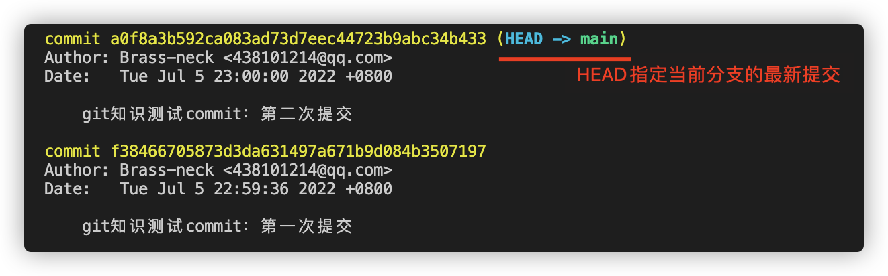
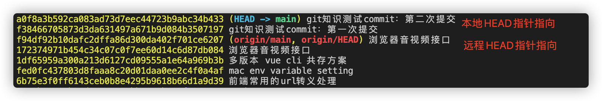
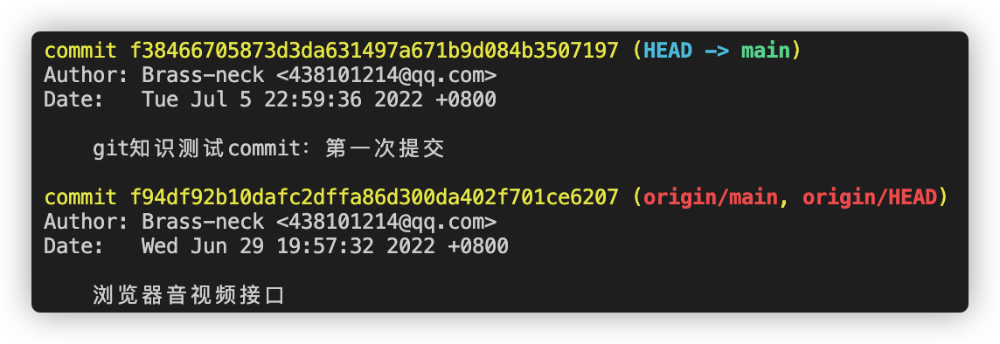
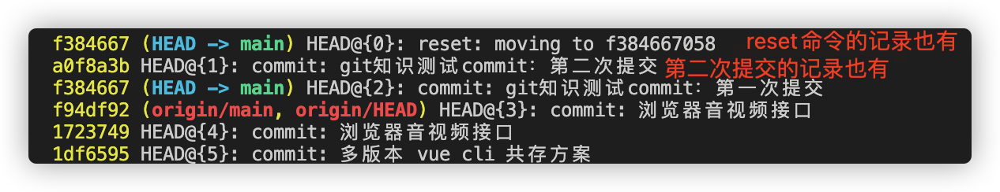

在平时的开发中，经常会遇到代码提交错了需要回滚到一个**历史版本**，或因为大意回滚错了代码又需要还原到一个**未来版本**，这种回滚和还原操作都离不开 git 操作命令历史记录的查询

那 git 为什么能实现回滚和撤销操作呢？主要跟 `HEAD` 有关，可以把 `HEAD` 理解成一个指针，`HEAD` 指针通常会指向一个**分支指针**
比如，当前处于 master 分支，那么`HEAD` 指针就会指向 master 分支指针，master 分支指针会指向具体的 commit 版本号；如果我们切换到 develop 分支，`HEAD` 指针就会指向 develop 分支指针

```js
// master 分支
HEAD -> master -> 00a12 -> fd63h4 -> ...

// develop 分支
HEAD -> develop -> fdj57 -> c4sq3 -> ...
```

git 允许我们在版本的历史和未来之间进行穿梭移动，就是通过改变 `HEAD` 的指针指向谁实现的，可以通过命令 `git reset --hard commit_id` 实现

**穿梭前，用 `git log` 可以查看提交历史，以便确定要回退到哪个版本。要重返未来，用 `git reflog` 查看命令历史，以便确定要回到未来的哪个版本**

## git log 命令

`git log` 命令可以显示**当前分支**所有提交过的版本信息，不包括**已经被删除**的 commit 记录和 reset 的操作。(注意: 只是当前分支操作的信息)

例如：在 main 分支修改一次文件并 commit 提交；再修改一次文件并 commit 提交，通过 `git log` 查到提交的信息如下


直接使用 `git log` 显示的信息太繁琐，可以加上参数 `--pretty=oneline` 只会显示版本号和提交时的备注信息，这样阅读起来更友好得多，也都可以看到远程 `origin/HEAD` 分支的指向


现在我们想回滚到第一次提交的版本，就可以使用`git log`查询到 第一次的 commit_id 来进行回滚：

```
git reset --hard f384667

HEAD is now at f384667 git知识测试commit：第一次提交
```

回滚后继续查看 `git log`，已经看不到被删除的 commit 记录了（第二次提交记录被删除），这时候我们想要回到第二次提交记录就不行了，就需要用到 `git reflog` 重返未来


## git reflog 命令

`git reflog` 命令可以查看**所有分支**的**所有操作记录**信息（包括已经被删除的 commit 记录和 reset 的操作）

例如：执行 `git reset --hard HEAD~1`，退回到上一个版本，用 `git log` 则是看不出来被删除的 commitid，用 `git reflog` 则可以看到被删除的 commitid，这样我们就可以买后悔药，恢复到被删除的那个版本

我们接着上面的例子，执行 `git reflog`，可以找到第二次提交记录的 commit_id


## 总结

`git log` 和 `git reflog` 的最大区别是能不能查询到**被删除的 commit 记录和 reset 的操作记录**，log 不能，而 reflog 可以；所以以后要买后悔药就去找 reflog
