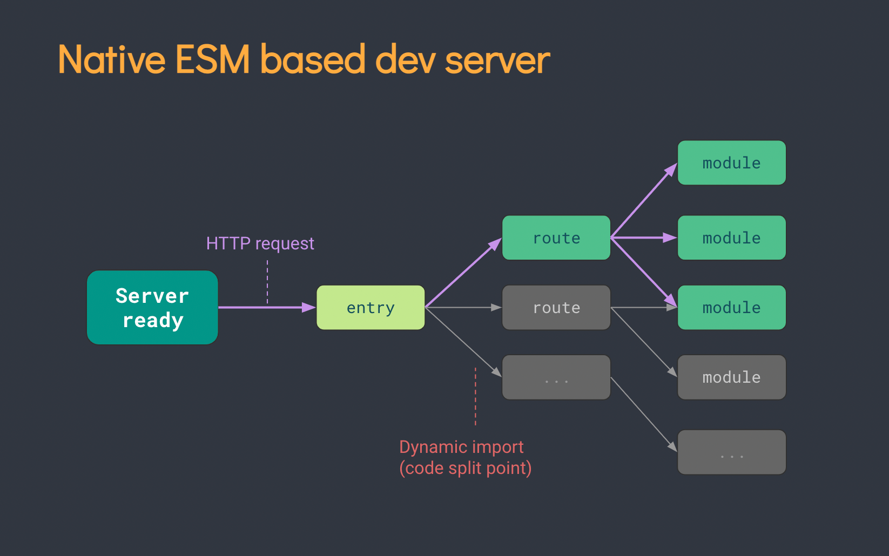

# 源起

最近在学习`Vite`的过程中，了解到 Vite 在构建开发服务器这块使用到了一些**浏览器新特性**，其中就包括 `JavaScript modules`的`动态加载`和`通过脚本标签来引入原生 ES 模块 `

# 动态加载 import()

- 浏览器中可用的 JavaScript 模块功能的最新部分是`动态模块加载`，这允许你仅在**需要时**动态加载模块，而不必预先加载所有模块

- import(path)，返回一个`promise`，回调参数是该模块对象，让你可以访问该模块的导出

```javascript
import('/modules/myModule.mjs').then((module) => {
  // Do something with the module.
})
```

- 兼容性方面，IE 11（不含）以上才支持该特性

  

## 在 Vite 中的应用

在`Vite`中可以使用特殊的`import.meta.glob`函数从文件系统导入多个模块

匹配到的文件将通过**动态导入默认懒加载**，并会在构建时分离为**独立的 chunk**

```javascript
const modules = import.meta.glob('./dir/*.js')

// 上一句会被转译为下面的样子：
const modules = {
  './dir/foo.js': () => import('./dir/foo.js'),
  './dir/bar.js': () => import('./dir/bar.js')
}

// 可以遍历modules来访问相应的模块
for (const path in modules) {
  modules[path]().then((m) => {
    console.log(path, m)
  })
}
```

# 通过脚本标签来引入原生 ES 模块

## 保证向后兼容的 nomodule

支持`type="module"`的浏览器会忽略`nomodule`属性的 script 标签，而不支持`type="module"`的浏览器会走`nomodule`标签，这个降级方案用于兼容那些不支持 module 语法的浏览器

```javascript
<script type="module" src="module.js"></script>
<script nomodule src="compat.js"></script>
```

同样的，IE 11 （不含）以上才支持该新特性


## type="module"的 script 缺省为 defer

定义了`type="module"`的 script，默认是`defer`的，关于`defer`先说 2 点：

1. defer script 的加载下载是异步的，不会阻塞 dom 解析渲染，但是执行的时候还是会阻塞的
2. defer script 会等所有的 defer script 加载完以后，才顺序执行，并且会在`DOMContenLoaded`之前执行  
   这里提一嘴`DOMContenLoaded`，是指`HTML 文档`被完全加载和解析完成之后触发，而无需等待`样式表、图像和子框架`的完全加载。区别于`load`，当所有资源（包括图片等）加载完成之后，`load` 事件才会被触发

```javascript
// 这个script默认是defer的
<script type="module" src="1.js"></script>

<script src="2.js"></script>

<script defer src="3.js"></script>

执行的顺序是  2.js, 1.js, 3.js.
```

**`inline module` 同样是 `defer `的**

```javascript
// 默认是defer
<script type="module">
  addTextToBody("Inline module executed");
</script>

<script src="1.js"></script>

// 注意：：普通的 inline script 会忽略 defer
<script defer>
  addTextToBody("Inline script executed");
</script>

// defer
<script defer src="2.js"></script>

执行的顺序是 1.js, inline script, inline module, 2.js
```

**`async module script` 会在加载完成后立刻执行，跟普通的 script 一样, `async` 属性能让 script 加载的同时并不阻碍 HTML 解析器的工作，而且在加载完成后立即执行**

```javascript
// 这个脚本将会在imports完成后立即执行
<script async type="module">
  import {addTextToBody} from './utils.js';

  addTextToBody('Inline module executed.');
</script>

// 这个脚本将会在脚本加载和imports完成后立即执行
<script async type="module" src="1.js"></script>
```

**`module script` 引入多次，但是只会执行一次**

```javascript
// 1.js 只执行一次
<script type="module" src="1.js"></script>
<script type="module" src="1.js"></script>
<script type="module">
  import "./1.js";
</script>

// 而普通的脚本会执行多次
<script src="2.js"></script>
<script src="2.js"></script>
```

**跟普通的 scripts 不同，`module script`（以及它们的 imports 行为）会受到 CORS 跨域资源共享限制，也就是说，跨域的 `module script` 必须返回带有有效 `Access-Control-Allow-Origin: *` 的 CORS 头信息**

```javascript
// 这个脚本不会执行，因为跨域资源共享限制
<script type="module" src="https://1.sh/no-cors"></script>

// 这个脚本不会执行，因为跨域资源共享限制
<script type="module">
  import 'https://1.sh/no-cors';

  addTextToBody("This will not execute.");
</script>

// 这个可以
<script type="module" src="https://1.sh/with-cors"></script>
```

## Mime-types 文档类型

跟普通的 scripts 不一样，`modules script` 必须指定一个有效的 `JavaScript MIME` 类型，如果没有这么做，你可能会得到 一个严格 MIME 类型检查错误：“The server responded with a non-JavaScript MIME type （服务器返回了非 JavaScript MIME 类型）”，并且浏览器会拒绝执行相应的 JavaScript 代码

```javascript
// 比如 node
res.setHeader('Content-type', 'text/javascript;')
```

## .mjs 与 .js

对于`module script`来说， V8 引擎团队推荐我们使用 `.mjs` 扩展名代替 `.js`，理由如下：

1. 比较清晰，这可以指出哪些文件是模块，哪些是常规的 JavaScript
2. 这能保证你的模块可以被运行时环境和构建工具识别，比如 Node.js 和 Babel

注意：

1. 一些工具不支持 `.mjs`，比如 `TypeScript`

## 在 Vite 中的应用

生产环境中：浏览器需要支持 **通过脚本标签来引入原生 ES 模块** ，可以通过官方插件 `@vitejs/plugin-legacy` 支持旧浏览器

原始的打包过程是，分析依赖，然后根据配置，构建整个应用，打出多个 bundle 包，并引入到 index.html 中，如下图


在 Vite 中，将应用中的模块区分为 `依赖` 和 `源码` 两类，并区别对待

**依赖**

依赖是指在开发中基本上不会变动的、庞大的第三方库内容。对于这部分内容，Vite 将会使用 `esbuild` **预构建依赖**（Esbuild 使用 Go 编写，并且比以 JavaScript 编写的打包器预构建依赖快 10-100 倍），来提升开发服务器页面加载速度

**预构建**中比较重要的是对于“裸模块”的一个处理，“裸模块”就是形如`import _ from 'lodash'`，`import {createApp} from 'vue'`的模块导入，from 之后是一个外部模块，该模块并不在我们的`src`源码中，而是可能在`node_modules`中，区别于形如`import a from './src/a'`的正常路径导入

针对“裸模块”，Vite 需要提前搜寻依赖，找到该模块在`node_modules`下的正确路径并替换，使得 http 请求可以找到资源

**源码**

源码包含一些并非直接是 JavaScript 的文件，可能需要转换（例如 JSX，CSS 或者 Vue/Svelte 组件），时常会被编辑。同时，并不是所有的源码都需要同时被加载

Vite 以 `原生 ESM` 的方式服务源码。这实际上是让浏览器接管了打包程序的部分工作：Vite 只需要在浏览器请求源码时进行转换并按需提供源码。根据情景动态导入的代码，即只在当前屏幕上实际使用时才会被处理，如下图



**综合**

Vite 对依赖和源码两大块都通过`ESM`的方式处理，好处就是开发过程中我们不需要编译构建了，直接就可以进行开发工作，减少了大量的开发时间成本。对于 Vite 实现的原理细节，请查看本项目（LongDrive）的子目录 `Vite/source-code-analyze`
