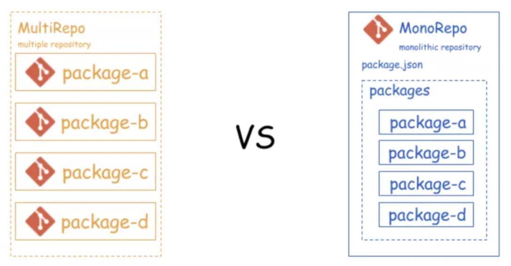

### 概念

- learn 是一种管理工具，一个 git 仓库里 管理 多个 package 软件包
- 可以管理多包的公共依赖 和 单包的单独依赖
- 多 package 之间可以直接内部 link 相互依赖，不必发版和安装依赖
- 可以单独发布和全体发布

### monorepo 和 multrepo 区别

monorepo： 是将所有的模块统一的放在一个主干分支之中管理

multrepo： 将项目分化成为多个模块，并针对每一个模块单独的开辟一个 reporsitory 来进行管理



### 安装

```sh
npm i -g lerna

# Independent 模式可以单独发版，更灵活
lerna init --independent
```

### 常用命令

```sh

# 初始化
mkdir lerna-demo
cd lerna-demo
lerna init


# 执行成功后得到的目录如下
- packages(存放package的目录)
- lerna.json(配置文件)
- package.json(工程描述文件)


# 创建package
lerna create


# 添加依赖，所有包都会安装上该依赖，并出现在各自 package.json 的 dependency 里
lerna add
# 某个包单独安装自己的依赖
# packages/p1包单独安装yargs
lerna add yargs packages/p1
# scope 对应的是 package.json 中的 name 字段
lerna add yargs --scope=moduleP1


# moduleA依赖moduleB，内部依赖
lerna add moduleB --scope=moduleA
# 注意这种依赖不会添加到 moduleA 的 node_modules 里，但会添加到 moduleA 的 package.json 中，它会自动检测到 moduleB 隶属于当前项目，直接采用symlink的方式关联过去


# 创建软链接
lerna link


# 重新安装所有依赖 并 创建软链接
# 假设 package 下面有一个包 pkg1 ，依赖 package 下面的另一个包 pkg2 。运行 lerna bootstrap 之后， pkg1/node_modules 下就会出现 pkg2 的 symlink
lerna bootstrap


# moduleA和moduleB都依赖lodash，且在各自 package 下的node_modules 里都有lodash，这其实很浪费空间，可以使用 --hoist
lerna bootstrap --hoist
# 这会将 packages 里重复的依赖提取到最外层的 node_modules 里，同时最外层的 package.json 也不会更新 dependency 信息
# 建议将依赖重复写到每个 子package.json 里，然后用 --hoist 提取到最外层node_modules


# 执行所有package下的脚本
# scriptName是所有package的package.json中script脚本
# --scope + 包名，是让指定的包执行脚本
# scope 对应的是 package.json 中的 name 字段
lerna run scriptName --scope packageName


# 执行shell脚本
# jest是实际的shell脚本，区别于scriptName，scriptName是key，shell脚本是value
lerna exec -- jest
```

### lerna 实现软链的原理

#### inode

众所周知，文件存储在硬盘上，硬盘的最小存储单位叫做 "扇区"（ `Sector`,每个扇区存储 512 字节）.操作系统读取硬盘的时候，不会一个个扇区地读取，因为这样效率太低，而是一次性连续读取多个扇区,这种一次性读取的连续多个扇区就是"块"( `block` )。这种由多个扇区组成的"块"，是文件存取的最小单位。"块"的大小，最常见的是 4KB，即连续八个 `sector` 组成一个 `block`

文件数据都储存在 "块" 中，那么很显然，我们还必须找到一个地方储存文件的元信息，比如文件的创建者、文件的创建日期、文件的大小等等。这种储存文件元信息的区域就叫做 `inode` ，中文译名为 "索引节点"

```sh
# linux获取某个文件的 inode 信息
stat index.js
```

```javascript
// node获取某个文件的 inode 信息
const fs = require('fs')
fs.statSync('./index.js')
```

#### 软链接(soft link，也叫符号链接)

- 软链接类似于 windows 下的“快捷方式”
- 比如为文件 a 创建了软链接文件 b，访问 b，系统会自动导向文件 a；但是 a 和 b 拥有各自不同的 inode ；修改文件 a 的内容，文件 b 的内容也会发生改变
- 当我们删除源文件 a 时，在访问软连接文件 b 是，会报错 "No such file or directory"
- 创建了软链接后我们就可以使用不同的文件名访问相同的内容

```javascript
// node中创建软链接
const fs = require('fs')
fs.symlinkSync(target, path, type)
// fa.symlinkSync(a, b)

target <string> | <Buffer> | <URL>   // 目标文件
path <string> | <Buffer> | <URL>  // 创建软链对应的地址
type <string>
```

#### 硬链接

- 一般情况下，一个文件名"唯一"对应一个 `inode`
- 但是 `linux` 允许多个文件名都指向同一个 `inode`，表示我们可以使用不同文件名访问同样的内容，硬链接和源文件拥有相同的`inode`
- 对文件内容进行修改将放映到所有文件
- 删除一个文件不影响另一个文件对访问

**删除一个文件不会影响另一个文件的访问。原因是什么?**

实际上，文件 `inode` 中还有一个`链接数`的信息，每多一个文件指向这个 `inode`，该数字就会加 1，每少一个文件指向这个 `inode`，该数字就会减 1，当值减到 0，系统就自动回收 `inode` 及其对应的 `block` 区域，很像是一种引用计数的垃圾回收机制

当我们对某个文件建立了**硬链接**后，对应的 `inode` 的链接数会加一变成 2（原文件本身已经有一个指向），当删除一个文件时，链接数变成 1，并没达到回收的条件，所以我们还是可以访问文件

#### lerna 的软链原理

lerna 创建的项目, packages 目录下各模块互相依赖是基于 `fs.symlinkSync` 创建软链接实现的
