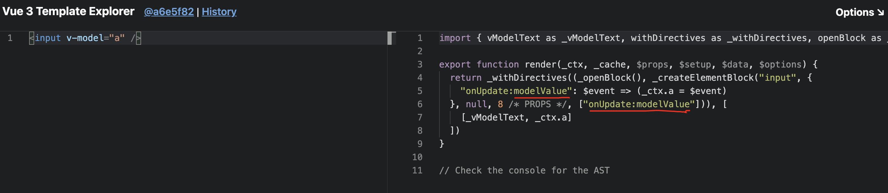
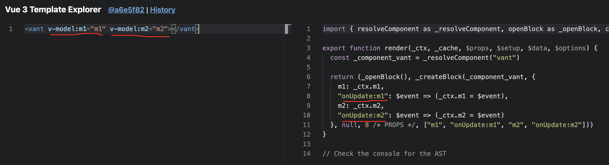

# h5-classroom

## 技术栈

`vue/cli4 + vue3 + ts + vuex4 + vant`

## Project setup

```
npm install
```

### Compiles and hot-reloads for development

```
npm run serve
```

打开 F12，在移动端模式下浏览项目

### Compiles and minifies for production

```
npm run build
```

### Customize configuration

See [Configuration Reference](https://cli.vuejs.org/config/).

<hr>
<hr>
<hr>

# keypoints record

## 目录结构组织

- @/typings/ 存放所有的类型
- @/store/action-types.ts 存放所有 actions 的名称
- @/hooks 存放不同功能的 hook 函数

## 按需引用 UI 组件

- 按需引用 vant 组件，配置按需引入后，main.ts 中将不允许直接导入所有组件

- 对于 vite 项目，可以使用 vite-plugin-style-import 实现按需引入, 原理和 babel-plugin-import 类似

- 如果你在使用 TypeScript，可以使用 ts-import-plugin 实现按需引入

## defineComponent

- defineComponent 包裹组件定义，可以提供内部良好的 ts 提示

## vuex module 命名空间

默认情况下，模块内部的`mutation`、`action`、`getter`都是注册在**全局命名空间**的，这样使得**多个模块**可以对同一`mutation`或者`action`作出响应（即，一个 mutation 或者 action 会被多个模块处理）

如果你不希望这样，可以通过设置模块的`namespaced: true`属性，使得模块具有更高的封装性和复用性，这样模块的`mutation`、`action`、`getter`都会只属于该模块，在发起时也需要书写模块的注册路径

```javascript
const store = createStore({
  modules: {
    module1: {

      namespaced: true,

      // 模块内的状态已经是嵌套的了，使用 `namespaced` 属性不会对其产生影响
      state: () => ({...}),

      getters: {
        // -> getters['module1/isAdmin']
        isAdmin() {...}
      },

      actions: {
        login () { ... } // -> dispatch('module1/login')
      },

      mutations: {
        login () { ... } // -> commit('module1/login')
      },

      // 继续嵌套一层
      modules: {
        module2: {
          // 这里不设置namespaced，所以继承父模块的命名空间
          state: () => ({ ... }),
          getters: {
            profile () { ... } // -> getters['module1/profile']
          }
        },

        module3: {
          // 这里设置namespaced，所以拥有自己的命名空间，并且是嵌套在父级里
          namespaced: true,

          state: () => ({ ... }),
          getters: {
            profile () { ... } // -> getters['module1/module3/profile']
          }
        }
      }
    }
  }
})
```

## vue3 v-model

vue3 中的`v-model`不同于 vue2 中的`v-model`，打开
[Vue 3 Template Explorer](https://vue-next-template-explorer.netlify.app/)，我们输入一段使用`v-model`的代码，查看编译后的内容，发现`v-model`是作用于`modelValue`这个变量的，而在 vue2 中，是作用于`value`变量，并且事件也发生了变化，vue2 中是`input`，vue3 中是`update:modelValue`



另外，vue3 中可以允许我们书写多个自定义的`v-model`，这是一个新特性，可以绑定多个双向绑定

