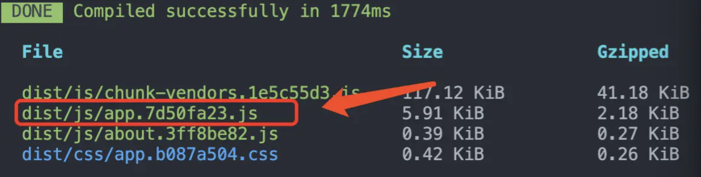
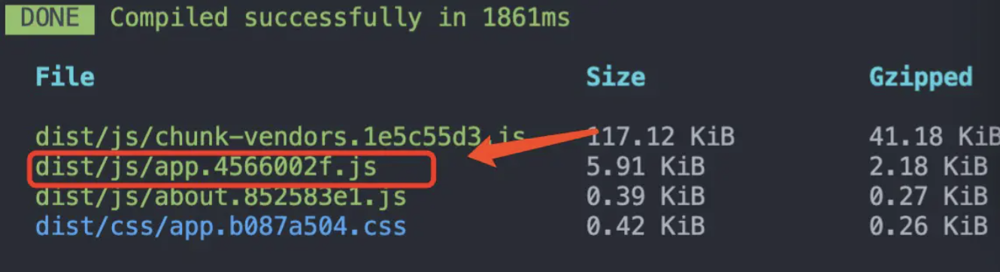
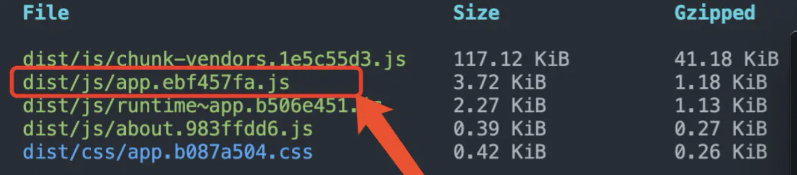
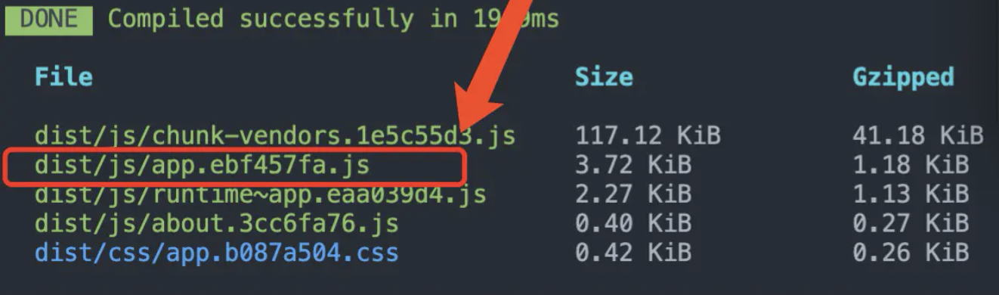

## 理解 webpack 的运行时代码

在 webpack 中，运行时代码即为**异步加载**的代码，比如下列形式：

```javascript
// 异步加载
import('xxx').then(res => ...)

// 异步路由
{
  path: '/about',
  name: 'About',
  component:() => import(/* webpackChunkName: "about" */ './about.vue')
}
```

## 实际测试

1. 搭建简单的 vue 项目，使用 vuecli 新建项目，包含`router`路由功能，路由配置一个异步加载的 `about` 路由（代码同上述异步路由）

2. 不设置 `runtimeChunk`时默认为 false，进行打包，结果如下图
   
   图中 `chunk-vendors`是第三方包的集合包，`app`是主入口包，`about`是异步路由产生的包

3. 修改`about.vue`的内容，再次打包，发现`app`和`about`的 hash 发生了变化，但是我们只修改了 about，about 变化就算了，app 也发生了变化，这不合理，不利于我们在项目中命中缓存
   

4. 配置`runtimeChunk`打一次包，修改`about.vue`的内容再打一次包，查看两次包的`app`的 hash 变化，首先发现多了一个`runtime`文件，然后`app`的 hash 没有发生变化，只是`runtime`和`about`的 hash 发生了变化
   

```javascript
module.exports = {
  configureWebpack: {
    runtimeChunk: true
  }
}
```

## runtimeChunk 做了什么

在`app`中引用`about`，当`about`内容发生变化，`app`中引用`about`的 hash 就会变化，导致`app`变化

设置`runtimeChunk`就是为了把`chunks映射关系`单独从`app`中提取出来，生成一个个`runtime~xxx.js`的文件，然后每次更改运行时代码文件时，`app.js`的 hash 值是不会改变的

## 还剩一点

`runtime~xxx.js`文件体积很小，就是一个加载 chunk 的依赖的关系文件，每次改动类似`about`这种运行时文件内容后，对应的 runtime 文件就会变化，所以每次都要重新请求新的 runtime 文件，可能请求它的时间比执行它的时间还要长

由于体积很小，我们考虑把它的内容直接**内联**到 html 文件中，而不单独生成文件，这样就不会额外去请求这个文件了，减少 http 请求。我们使用类似`html-webpack-inline-source-plugin`的插件来处理

```javascript
const ScriptExtHtmlWebpackPlugin = require('script-ext-html-webpack-plugin')
module.exports = {
  configureWebpack: {
    optimization: {
      runtimeChunk: true
    },
    plugins: [
      new ScriptExtHtmlWebpackPlugin({
        inline: /runtime~.+\.js$/ // 正则匹配runtime文件名
      })
    ]
  },
  chainWebpack: (config) => {
    config.plugin('preload').tap((args) => {
      args[0].fileBlacklist.push(/runtime~.+\.js$/) //正则匹配runtime文件名，去除该文件的preload
      return args
    })
  }
}
```

处理后的 html 文件：

```html
<!DOCTYPE html>
<html lang=en>

<head>
    <meta charset=utf-8>
    <meta http-equiv=X-UA-Compatible content="IE=edge">
    <meta name=viewport content="width=device-width,initial-scale=1">
    <link rel=icon href=/favicon.ico>
    <title>runtime-chunk</title>
    <link href=/js/about.cccc71df.js rel=prefetch>
    <link href=/css/app.b087a504.css rel=preload as=style>
    <link href=/js/app.9f1ba6f7.js rel=preload as=script>
    <link href=/css/app.b087a504.css rel=stylesheet>
</head>

<body><noscript><strong>We're sorry but runtime-chunk doesn't work properly without JavaScript enabled. Please enable it to continue.</strong></noscript>
    <div id=app></div>
    <script>(function (e) { function r(r) { for (var n, a, i = r[0], c = r[1], l = r[2], f = 0, s = []; f < i.length; f++)a = i[f], Object.prototype.hasOwnProperty.call(o, a) && o[a] && s.push(o[a][0]), o[a] = 0; for (n in c) Object.prototype.hasOwnProperty.call(c, n) && (e[n] = c[n]); p && p(r); while (s.length) s.shift()(); return u.push.apply(u, l || []), t() } function t() { for (var e, r = 0; r < u.length; r++) { for (var t = u[r], n = !0, a = 1; a < t.length; a++) { var c = t[a]; 0 !== o[c] && (n = !1) } n && (u.splice(r--, 1), e = i(i.s = t[0])) } return e } var n = {}, o = { "runtime~app": 0 }, u = []; function a(e) { return i.p + "js/" + ({ about: "about" }[e] || e) + "." + { about: "cccc71df" }[e] + ".js" } function i(r) { if (n[r]) return n[r].exports; var t = n[r] = { i: r, l: !1, exports: {} }; return e[r].call(t.exports, t, t.exports, i), t.l = !0, t.exports } i.e = function (e) { var r = [], t = o[e]; if (0 !== t) if (t) r.push(t[2]); else { var n = new Promise((function (r, n) { t = o[e] = [r, n] })); r.push(t[2] = n); var u, c = document.createElement("script"); c.charset = "utf-8", c.timeout = 120, i.nc && c.setAttribute("nonce", i.nc), c.src = a(e); var l = new Error; u = function (r) { c.onerror = c.onload = null, clearTimeout(f); var t = o[e]; if (0 !== t) { if (t) { var n = r && ("load" === r.type ? "missing" : r.type), u = r && r.target && r.target.src; l.message = "Loading chunk " + e + " failed.\n(" + n + ": " + u + ")", l.name = "ChunkLoadError", l.type = n, l.request = u, t[1](l) } o[e] = void 0 } }; var f = setTimeout((function () { u({ type: "timeout", target: c }) }), 12e4); c.onerror = c.onload = u, document.head.appendChild(c) } return Promise.all(r) }, i.m = e, i.c = n, i.d = function (e, r, t) { i.o(e, r) || Object.defineProperty(e, r, { enumerable: !0, get: t }) }, i.r = function (e) { "undefined" !== typeof Symbol && Symbol.toStringTag && Object.defineProperty(e, Symbol.toStringTag, { value: "Module" }), Object.defineProperty(e, "__esModule", { value: !0 }) }, i.t = function (e, r) { if (1 & r && (e = i(e)), 8 & r) return e; if (4 & r && "object" === typeof e && e && e.__esModule) return e; var t = Object.create(null); if (i.r(t), Object.defineProperty(t, "default", { enumerable: !0, value: e }), 2 & r && "string" != typeof e) for (var n in e) i.d(t, n, function (r) { return e[r] }.bind(null, n)); return t }, i.n = function (e) { var r = e && e.__esModule ? function () { return e["default"] } : function () { return e }; return i.d(r, "a", r), r }, i.o = function (e, r) { return Object.prototype.hasOwnProperty.call(e, r) }, i.p = "/", i.oe = function (e) { throw console.error(e), e }; var c = window["webpackJsonp"] = window["webpackJsonp"] || [], l = c.push.bind(c); c.push = r, c = c.slice(); for (var f = 0; f < c.length; f++)r(c[f]); var p = l; t() })([]);</script>
    <script src=/js/chunk-vendors.1e5c55d3.js></script>
    <script src=/js/app.9f1ba6f7.js></script>
</body>
</html>
```
