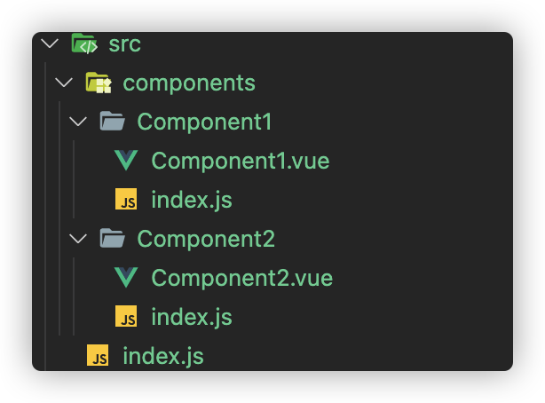

# 描述

使用 webpack 打包一个可以**按需引入**的组件库

# 源起

以 element-ui 为例，我们使用该 UI 库时，可能会通过以下方式：

1. 通过 `script` 标签直接引入 `element.min.js`，然后就可以全局直接使用，这种情况其实是将整个组件库全部引入进来，体积非常大，并且无法做到按需引入，不推荐

2. 通过`import`引入，并通过`Vue.use()`完成组件的全局注册

   ```js
   // vue.use 实际上是调用了组件库入口文件的 install 方法
   // src/index.js

   import Component1 from './components/1.vue'
   import Component2 from './components/2.vue'

   function install(Vue) {
     Vue.component(Component1.namne, Component1)
     Vue.component(Component2.namne, Component2)
   }

   // 通过`script`标签引入的情况会走这里，在组件内部完成组件注册
   if (window && window.Vue) {
     Vue.use(install)
   }

   export default install
   ```

# 使用 webpack 进行打包

### 理解 webpack 的 libraryTarget

经过对 webpack 官网的研究，总结一下 `libraryTarget` 这个属性，它一般和`library`属性搭配使用，意思是将项目按照`libraryTarget`的方式打包，并赋值给`library`提供的变量名

注意：最新版 webpack 已经计划使用 `type` 属性代替`libraryTarget`，下面我们都使用最新的`type`属性

`libraryTarget`可选值：`var assign this window global jsonp system commonjs commonjs2 amd umd module`

比如 `var`，意思是将打包结果分配给一个变量：

```js
// webpack配置
module.exports = {
  //...
  output: {
    library: {
      name: 'MyLibrary',
      type: 'var' // 对应老版本的 libraryTarget: 'var'
    }
  }
}

// 引入与使用
var MyLibrary = _entry_return_
MyLibrary.doSomething()
```

我们常用的是 `umd`，它将项目暴露为所有的模块定义下都可运行的方式（通用方式）。它在 CommonJS, AMD 环境下都可以运行，或将模块导出到 `global` 下的变量

```js
// webpack配置
module.exports = {
  //...
  output: {
    library: {
      name: 'MyLibrary',
      type: 'umd'
    }
  }
}

// 还可以给每一种模式都单独配置名称
module.exports = {
  //...
  output: {
    library: {
      name: {
        root: 'MyLibrary',
        amd: 'my-library',
        commonjs: 'my-common-library',
        commonjs2: 'my-common2-library'
      },
      type: 'umd'
    }
  }
}
```

这里我想说一下 `commonjs` 和 `commonjs2`的微妙差别，前者会将结果赋值给`exports`对象，是 CommonJS 环境使用的；后者会将结果赋值给`module.exports`，是 Node.js（CommonJS）环境中使用的

```js
// commonjs
module.exports = {
  // …
  output: {
    library: {
      name: 'MyLibrary',
      type: 'commonjs'
    }
  }
}

// 赋值
exports['MyLibrary'] = _entry_return_

// 使用
require('MyLibrary').doSomething()

///////////////////////////////////
///////////////////////////////////

// commonjs2
module.exports = {
  // …
  output: {
    library: {
      name: 'MyLibrary',
      type: 'commonjs2'
    }
  }
}

// 赋值
module.exports = _entry_return_

// 使用
require('MyLibrary').doSomething()
```

**最后，最重要的`module`方式，是输出 ES 模块，也就是可以帮助我们做按需引入的，但是遗憾的是 webpack 目前还未完全支持该功能，所以需要我们自己另辟蹊径**

请确保事先启用 `experiments.outputModule`

<hr>

### 理解 webpack 的 externals

在我们的组件库中，我们的打包结果需要将依赖的第三方包剔除出去，只保留我们自己的组件库，这里就借助`externals`属性，防止将某些 import 的第三方包打包到我们的 bundle 中，而是在运行时（runtime）再从外部获取

首先配置 webpack，剔除第三方包

```js
module.exports = {
  externals: {
    // 属性名称是 jquery，表示应该排除 import $ from 'jquery' 中的 jquery 模块
    // 为了替换这个模块，jQuery 的值将被用来检索一个全局的 jQuery 变量
    jquery: 'jQuery',
    vue: {
      root: 'Vue', //通过 script 标签引入，此时全局变量中可以访问的是 Vue
      commonjs: 'vue', //可以将vue作为一个 CommonJS 模块访问
      commonjs2: 'vue', //和上面的类似，但导出的是 module.exports.default
      amd: 'vue' //类似于 commonjs，但使用 AMD 模块系统
    }
  }
}
```

然后配置外部获取的方式：

方式一：在`index.html`中直接通过 script 标签引入 JS

方式二：使用 html-webpack-externals-plugin

```js
// 第一步 安装
npm i html-webpack-externals-plugin -D

// 第二部 配置
const HtmlWebpackExternalsPlugin = require('html-webpack-externals-plugin');

module.exports = {
    // 其它省略...
    plugins: [
        new HtmlWebpackExternalsPlugin({
          externals: [{
            module: 'vue',
            entry: 'https://lib.baomitu.com/vue/2.6.12/vue.min.js',
            global: 'Vue'
          }]
        })
    ],
    // 其它省略...
}
```

<hr>

### 按需加载

要做到按需引入，需要组件库以**ES6 模块化**的方式导出，也就是导入导出必须是下面代码的样子：

```js
import { xxx } from 'xxx'
import yyy from yyy
export default zzz;
export { a, b, c };
```

上面说过，我们通过`umd`方式打包的结果不支持按需引入，并且 webpack 还未完全支持输出 ES 模块的方式，所以我们要自己想办法

这里我们使用**多入口打包**的方式来实现，说白了就是把每一个组件都作为一个入口单独打包，每个组件都导出一个`install函数`，再通过`Vue.use(xxx)`来分别调用组件的函数来做到按需加载与注册

明白了原理，我们来实操，按照理解，我们的 webpack 配置文件会变成下面这个样子，即每个组件拥有一个 entry 入口，main 入口是整个组件库的入口，用于 script 标签方式整体引入

```js
module.exports = {
  entry: {
    component1: './src/components/1/index.js',
    component2: './src/components/2/index.js',
    main: './src/index.js'
  },
  output: {
    path: path.join(__dirname, '/lib'),
    filename: '[name].js',
    libraryTarget: 'umd',
    library: '[name]',
    libraryExport: 'default'
  }
}
```

在 entry 里，我们需要解放双手，自动写入所有组件的入口，前提是我们需要组织统一的组件文件夹结构，如下：



同时，为每一个组件提供一个 install 函数，写在组件各自的 index.js 中：

```js
import Component1 from './Component1.vue'

export default function (Vue) {
  Vue.component(Component1.name, Component1)
}
```

然后，写一个工具函数，帮我们自动生成所有组件的入口路径，得到 `[{componentName1: componentPath1},{componentName2: componentPath2}]` 的数据结构，然后写到配置文件里

```js
function generateEntries(src) {
  let entries = fs.readdirSync(path.resolve(__dirname, 'components'))
  return entries.map((en) => ({
    [en]: path.resolve(src, 'components', en, './index')
  }))
}

// 配置文件改为
module.exports = {
  entry: {
    main: './src/index.js',
    ...generateEntries(src)
  }
  // ...
}
```

最后，我们还需要将每个组件的 css 样式单独提取出来，实现样式的按需引入，这里使用`mini-css-extract-plugin`插件

```js
// 安装
npm i mini-css-extract-plugin -D

// 配置文件
const MiniCssExtractPlugin = require('mini-css-extract-plugin')

module.exports = {
  module:{
    rules:[
      {
        test:/\.css$/,
        use:[MiniCssExtractPlugin.loader,'css-loader','postcss-loader'],
      {
        test:/\.s[ac]ss$/,
        use:[MiniCssExtractPlugin.loader,'css-loader','postcss-loader', 'sass-loader']
      }
    ]
  },
  plugins:[
    new MiniCssExtractPlugin({
      filename: 'lib-style/[name].css'
    })
  ]
}
```

<hr>

### 其他方案

除了 webpack，我们还可以使用 `rollup.js`，来打包，它能很好地支持 ES Module，tree-shaking 也是 rollup.js 先提出的，实现组件库地按需加载就简单很多
