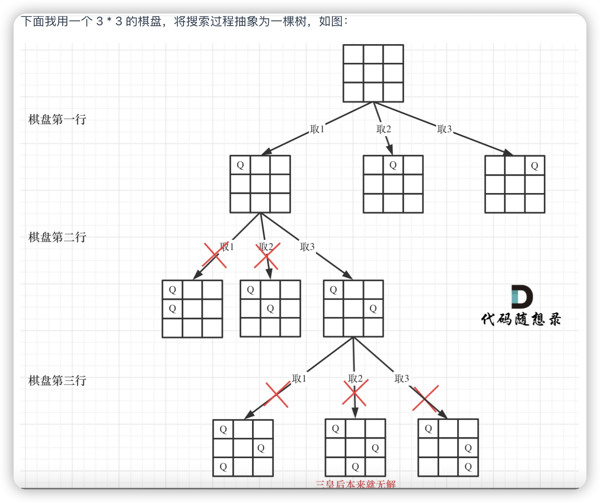

# 回溯模板

```js
void backtracking(参数) {
    if (终止条件) {
        存放结果;
        return;
    }
    for (选择：本层集合中元素（树中节点孩子的数量就是集合的大小）) {
        处理节点;
        backtracking(路径，选择列表); // 递归
        回溯，撤销处理结果
    }
}
```

# 全排列

- 里层循环
  - 每次都从 0 开始（而不从 startIndex 开始了）
  - 当收集元素的数组 path 的大小达到和 nums 数组一样大的时候，说明找到了一个全排列
- 但是需要排除已经用过的，使用一个 used 记录

```js
var permute = function (nums) {
  const res = [],
    path = []
  backtracking([])
  return res

  function backtracking(used) {
    if (path.length === nums.length) {
      res.push(Array.from(path))
      return
    }
    for (let i = 0; i < nums.length; i++) {
      // 全排列，每次都从0开始
      if (used[i]) continue
      path.push(nums[i])
      used[i] = true // 同支
      backtracking(used)
      path.pop()
      used[i] = false
    }
  }
}
```

# 二维数组去重

[[1,2,3],[3,2,1],[1,1,2],[1,1,2]]

```js
;[...new Set(arr.map(JSON.stringify()))].map(JSON.parse)

Array.from(new Set(arr.map(JSON.stringify))).map(JSON.parse)
```

# N 皇后问题



- 递归深度就是 row 控制棋盘的行，每一层里 for 循环的 col 控制棋盘的列，一行一列，确定了放置皇后的位置
  - 外层：每一行遍历，内层：每一列遍历
  - 每次都是要从新的一行的起始位置开始搜，所以 column 都是从新行的 0 开始
- 当递归到棋盘最底层（也就是叶子节点）的时候，就可以收集结果并返回了
- 验证棋盘是否合法

  - 不能同行
  - 不能同列
  - 不能同斜线 （45 度和 135 度角）

  ```js
  if (row == n) {
    result.push_back(chessboard)
    return
  }
  ```
