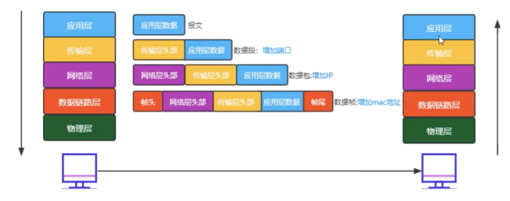

# 网络基础概念

## OSI（Open System Interconnection）七层模型

- 7 层是理想化的，实际常说的是 5 层 或者 4 层
- 对网络划分层级，每一层专人做专事

### 层级划分

从底层依次往上：

> 1、2 层合称为 网络接口层

> 1.  物理层（局域网阶段）

只关心如何传输数据，传输的是 0 1 的比特流

设备：光纤、电缆、网线、中继器等

网线，有一个最大长度限制 100 米左右，可以再中间位置使用中继器（放大器），延长网线传输距离

物理层只负责传输和广播数据，会把数据发给所有的用户，不关心安全性等问题，需要链路层来解决

> 2.  数据链路层（局域网阶段）

只关心如何将两个设备连接起来

设备：交换机等

交换机记录了用户的 mac 地址，可以保证数据只发送给指定的人

> 3.  网络层（互联网阶段）

只关心 IP 寻址

设备：路由器

默认两个不同的网络，是不能进行通信的，要通信，需要经过网关，我家的路由器，就充当网关角色，它可以把我机器的内网转为外网传给别的路由器，别的路由器把收到的外网转为它的用户的内网

路由器有 wan 口 和 lan 口，分别有自己的一张网卡，即一个路由器最少要有 2 个网卡（网卡有自己的 mac 地址），wan 口是充当网关用来上网的，lan 口是用来做局域网的，如果一个路由器没有 wan 口，那就相当于一台交换机

> 4.  传输层

只关心怎么传？丢了要不要重传？

> 5、6、7 合称为 应用层

> 5.  会话层

建立会话

> 6.  表示层

只关心数据的描述，比如压缩、加密

> 7.  应用层

用户最终使用的接口，比如 qq、微信等

### 层级功能

> 发送数据的时候，从应用层开始准备数据，依次向下层装包数据；  
> 接收数据的时候，从物理层开始，依次向上层拆包数据

应用层：得到**数据报文**

传输层：增加传输层头部，也就是增加端口（门牌号），得到**数据段**

网络层：增加网络层头部，也就是增加 IP（确定省市区小区），得到**数据包**

数据链路层：增加帧头，帧尾，也就是增加 mac 地址，得到**数据帧**

### 网络中的协议

1.  应用层

    - HTTP
    - DNS（域名解析，域名 -> ip 地址）
    - DHCP（dynamic host configuration protocol 动态主机配置协议），自动获取网络配置 ip 等，无需手动配置 ip 地址

2.  传输层

    - TCP
    - UDP

3.  网络层

    - IP 协议
    - ARP （地址转化协议，把 ip 转为 mac 地址。在交换机中，通过广播，获取连接到交换机的机器的 ip、mac，并与交换机的端口进行一一对应，形成一个映射表）

### 相关知识补充

- IPV4：IP 地址的第四个版本，最大值 255.255.255.255，可代表的地址数量为 `255 * 255 * 255 * 255 = 大约 42亿个`

- IPV6：IP 地址的第六个版本，比如 2408:8207:7884:cd98:6ee6:rg4j:s532，由 8 段组成，比 v4 数量大了很多

- mac 地址：物理地址，原则上是唯一的，每个网卡都会有一个 mac 地址

- IP 地址可能是不固定的，有了 IP 地址不一定能找到那个人，但是 mac 地址是每个网卡都会写一个唯一的
