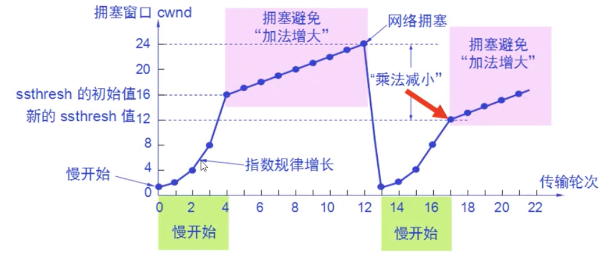

# DNS 协议

- 是一个应用层协议
- 是域名解析协议，域名 -> ip 地址

### 步骤

www.baidu.com(是一个二级域名，有几个.点就是几级域名)，从右往左解析

1. 域名被解析过了，读取缓存，直接返回 ip 地址，缓存可能是在本机器的本地（host 文件、dns 缓存文件），也可能在路由器（dns 缓存列表）

2. 没缓存，要向根 DNS 服务器发起 UDP 请求进行查询，依次递归查询.cn、.com.cn、.baidu.com.cn 的 IP

# TCP

- TCP 的数据格式，TCP 的头部最少是 20 字节，如果发送的数据非常小，只有 1 字节，那么每次传输也至少是 21 字节

- SYN 握手，ACK 确认，PSH 发消息，FIN 结束通信

### 握手挥手

- 三次握手

  1. 客户端 SYN 我要和你通信
  2. 服务端 ACK 同意 ，服务端 SYN 我也要和你通信
  3. 客户端 ACK 同意

- 四次挥手

  1. 客户端 FIN 断开通信 seq=160，ack=112

  2. 服务端 ACK 同意 ack=160+1（应答要在前者的询问的基础上 加 1 ，保证准确应答），seq=112（拿前者的 ack 作为自己的 seq）

  3. 如果还有未发送完的数据，发送完毕后，服务端 FIN 断开通信，ack=161，seq=112

  4. 客户端 ACK 同意，ack=112+1，seq=161（如果这个应答包丢失了，服务器没收到应答，服务器会重新发送 FIN 信号，直到客户端应答）

  5. TIME WAIT，是指客户端发送完最后的 ACK 后，不能立刻关闭，而是要等 1-2min，等服务端没有什么东西发过来了，再关闭，防止服务器没收到最后的 ACK 而再次发送 FIN 信号。如果等着，就会占用端口，会导致无法有新的连接进来，对于**高并发短链接**是不适合的。所以 http1.0 -> http1.1

<hr>

### 发送数据

> A 和 B 通信，各自都需要一个 sequence 序列号，来标识数据的顺序

当客户端和服务器三次握手完成后，ack 和 seq 都是 1

客户端发送数据给服务端：ack=1，seq=1，len=5（数据长度）

服务端收到数据：ack=1+5=6，seq=1（长度是 5 的数据收到了，下次你要从 6 开始发，但是我没给你发数据，我的 seq 还是 1）

服务端给客户端发数据：seq=1，ack=6，len=2

客户端收到数据：ack=1+2=3，seq=6

<hr>

### 滑动窗口

- tcp 是全双工流，发送端有发送缓存区，接收端有接收缓存区，要发送的数据都放在发送缓存区，滑动窗口就是要发送缓存区中的哪一部分

- 核心是**流量控制**，服务端可以根据网络情况，告诉客户端可以接收的数据数量，客户端按照约定的数量，来发送数据

- 存在一个问题：**队头阻塞**，比如，3 条数据里，数据包 2、数据包 3 先到达了，但是数据包 1 一直没到达，那么滑动窗口就无法往后滑动，要一直等到 数据包 1 到了，才能往后滑动；

- **超时重传**：如果 数据包 1 一直没有到达，就会触发超时重传 RTO

> A 和 B 通信，各自都有一个缓冲区，缓冲区里有一个滑动窗口

首先，先协商，B 告诉 A，我这次可以接收 3 条数据，那么 A 的滑动窗口就会锁定自己缓存区的 3 条数据，准备发给 B，每个数据发送到后，都会收到 B 的 ack 确认，但是这 3 条数据，可能会乱序到达 B

3 条数据最后一条数据收到并且 ack 时，B 继续告诉 A，接下来我可以接收 2 条数据，A 就会调整自己滑动窗口的大小为 2，然后发送数据

当 B 的缓存区满了，A 的滑动窗口大小就变成 0，不再发送数据，而是等待**上层 HTTP 协议** 来消耗缓存区的数据，消耗后，B 会通知 A，我的缓存区又可以接收 3 条数据了；如果 B 通知 A 的时候丢包了，也没关系，因为 A 会不停的发送探测请求，问 B 你的缓存区是否可以接数据了（注意不是 options 请求，options 是 http 层面的，而这里是传输层 TCP 协议）

<hr>

### 粘包

- 默认是 nagle 算法

- 可以使用 cork 算法进行粘包

```js
// 这样发送数据，会发送 3个 数据包，每个数据包都有 20字节 的头部，造成性能浪费
socket.on('connect', () => {
  socket.write('1')
  socket.write('2')
  socket.write('3')
})

// 通过 cork 算法，把多个小包 合并成 一个大包 ，只发送一次，节省性能
socket.on('connect', () => {
  socket.cork()
  socket.write('1')
  socket.write('2')
  socket.write('3')
  socket.uncork()
})
```

<hr>

### TCP 存在的问题

1. 队头阻塞

2. 在非长连接的情况下，大量连接处于通信结束的 TIME WAIT 状态，导致大量端口被占用

3. 慢启动，当达到了网络堵塞而丢包时，回到最最开始，效率低

   

   为了减少 慢启动的情况，使用 **快重传**，对于丢失的包再重传一次，而不是重头开始启动网络；**快恢复**，恢复到原来的一半，而不是重头开始

# 额外知识补充

- 位（bit）是最小的存储单位，每一个位存储一个 1 位的二进制码
- 一个字节（byte）由 8 位组成
- 1kb(千字节) = 1024b
- 1mb(兆字节) = 1024kb(千字节)

# UDP

面向报文的，不需要建立连接，速度快，只要数据发送出去就不管了，不保证数据完整性、安全性

```js
// node 中的 dgram模块 是用来创建 udp 连接的
let dgram = require('dgram')
let socket = dgram.createSocket('udp4')
socket.on('messgae'(msg, rinfo)=>{})
socket.bind(41234, 'localhost')
```
